# Python day 01

## 1. 파이선 기초 "Hello, World!" 출력하기.

* Python IDLE 실행화면

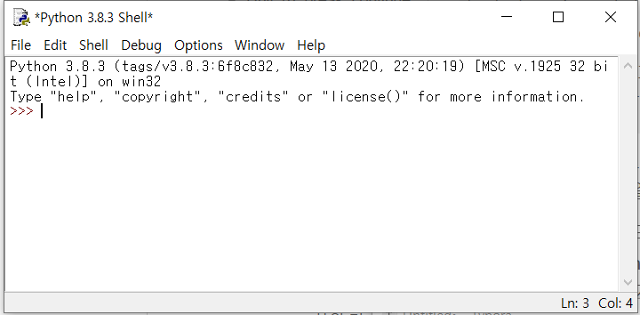

```python
print("Hello, World!")
print('Hello, World!')

```

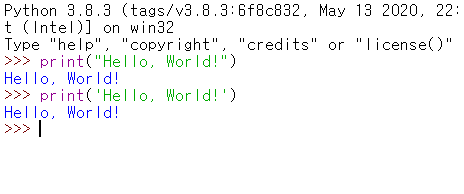


> 문자열 출력 함수는 `print()`, `""`, `''` 상관없이 모두 문자열을 출력한다. 

*  IDLE처럼 파이썬 코드를 직접 입력해서 실행하는 프로그램을 파이썬 셸(Python Shell)이라고 하며 **>>>** 부분을 파이썬 프롬프트(Python prompt)라고 부릅니다. 즉, 파이썬 셸을 통해서 파이썬 코드를 해석(interpret)해주는 인터프리터를 사용하게 됩니다.

>  **참고 |** **대화형 셸**
>
> 파이썬 셸은 파이썬 인터프리터와 대화하듯이 코드를 처리한다고 해서 대화형 셸(interactive shell) 또는 인터렉티브 모드(interactive mode)라고도 부릅니다. 특히 이런 방식을 코드를 읽고, 평가(계산, 실행)하고, 출력한다고 해서 REPL(Read-Eval-Print Loop)이라고 합니다.

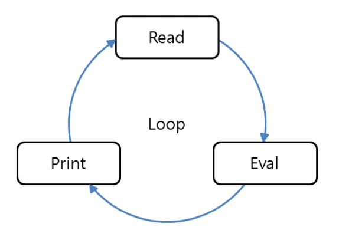


## 2. IDLE 에서 소스코드 실행하기.

* `File - New File` 을 이용하여 스크립트 창을 띄운다.

  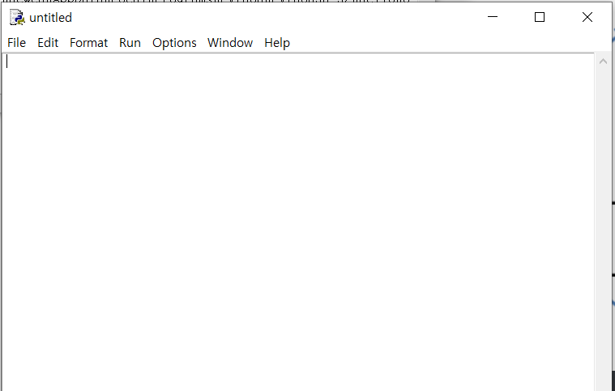

* 코드를 작성한후 저장한다.

  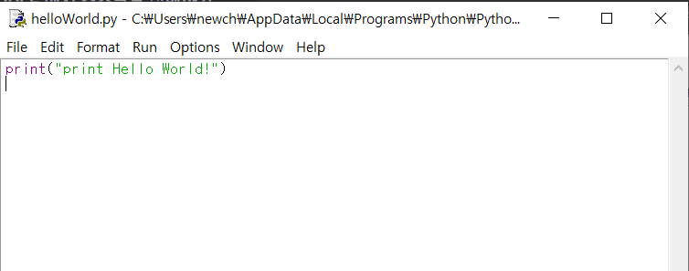

* `F5` 키를 누르거나 `Run - Run Module` 을 이용하면 해당 코드를 IDLE 에 실행 시킬 수 있다.

  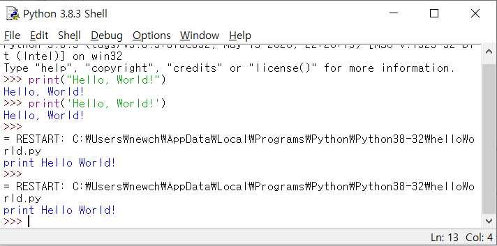

  

## 3. 명령 프롬프트(CMD)에서 Python 실행하기.

1. cmd 창에서 python 을 입력하면 파이선 셀이 실행된다.

   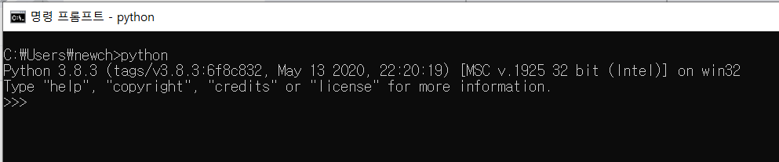

2. 화면이 위와 같이 뜨면 IDLE 와 똑같이 파이선 코드 실행이 가능하다.

   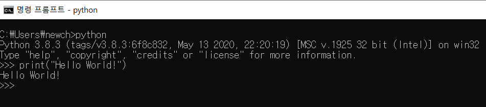

3. 작성된 스크립트 파일을 실행하려면 cmd 창에서 해당 파일이 있는 폴더로 이동후 `python 파일이름.py` 하거나 경로 전체를 입력시켜 준다.

   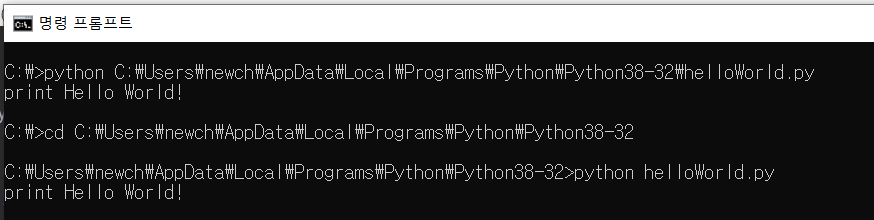

---

## 기초문법

1. 세미콜론

   * 많은 프로그래밍 언어들은 구문이 끝날 때 `;(세미콜론)` 을 붙어야 한다. 하지만 파이썬은 붙이지 않는다.

   ```python
   print('Hello, World')
   ```

   * 단, 세미콜론을 붙여도 문법 에러는 발생하지 않는다. 보통 한 줄에 여러 구문을 사용할 때 세미콜론으로 구분해준다.

   ```python
   print('Hello'); print('1234')
   ```

2. 주석

   * 파이썬에서 사람만 알아볼 수 있도록 작성한 부분을 주석(Comment)라고 한다. 즉, 주석은 파이썬 인터프리터가 처리하지 않으므로 프로그램 실행에는 영향을 주지 않는다. 
   * 보통 주석은 코드에 대한 자세한 설명을 작성하거나, 특정 코드를 임시로 사용하지 않도록 만들 때 사용한다.

   1. 한줄 주석

      ```python
      # Hello, world! 출력
      print('Hello, world!')
      ```

      * 코드 맨 앞에 `#`을 사용하면 해당 줄은 모두 주석이된다. 따라서 print 함수는 동작하지 않는다.

      ```python
      # print('Hello, world!')
      ```

      * 코드 뒤에 `#` 을 작성하게 되면 앞에 코드는 실행되고 `#` 뒤에 문장은 실행되지 않는다.

      ```python
      print("Hello world!") #printf("123456")
      ```

   2. 블록 주석

      * 보통 블록 주석을 작성할 때는 읽기 쉽도록 # 뒤에 공백을 한 칸 띄운다.

      ```python
      # 더하기
      # a = 1 + 2
      # print ('Hello, World!')
      ```

   > 한글 주석 사용시 주의점.
   >
   > 파이썬 3에서는 .py 스크립트 파일의 기본 인코딩이 UTF-8이다. 스크립트 파일을 다른 인코딩(EUC-KR, CP949등) 으로 저장하면 실행하였을 때 에러가 발생한다.
   >
   > 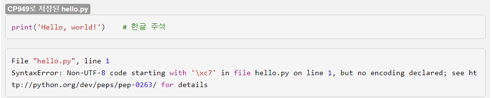
   >
   > 이때는 스크립트 파일을 UTF-8 파일로 저장하면 에러를 해결할 수 있다. 

   

3. 들여쓰기

   * 들여쓰기는 코드를 읽기 쉽도록 일정한 간격을 띄워서 작성하는 방법이다. 특히 파이썬은 **들여쓰기 자체가 문법**이다. 예를 들어 if의 다음 줄은 항상 들여쓰기를 해야 한다. 만약 들여쓰기를 하지 않으면 문법 에러이므로 코드가 실행되지 않는다.

   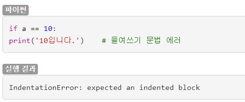

   * 올바른 코드는 다음과 같이 if의 다음 줄은 들여쓰기를 해줘야 한다.

   ```python
   if a==10:
       print('10입니다.')
   ```

   * 파이썬에서 들여쓰기는 3가지 방식이 있다.
     1. 공백 2칸
     2. 공백 4칸
     3. 탭 1칸
   * 3가지 모두 잘 동작하지만 파이썬 코딩 스타일 가이드(PEP 8)에서는 공백 4칸을 규정으로 하고있다. 따라서 공백 4칸을 사용하는 것이 좋다.

4. 코드블록

   * 코드 블록은 특정한 동작을 위해서 코드가 모여 있는 상태를 뜻하며 파이썬은 들여쓰기를 기준으로 코드 블록을 구성한다.

   ```python
   if a==10:
       print('10')
       print('입니다.')
   ```

   * 단, 같은 블록은 들여쓰기 칸 수가 같아야 하고, 공백과 탭 문자를 섞어 쓰면 안된다.

   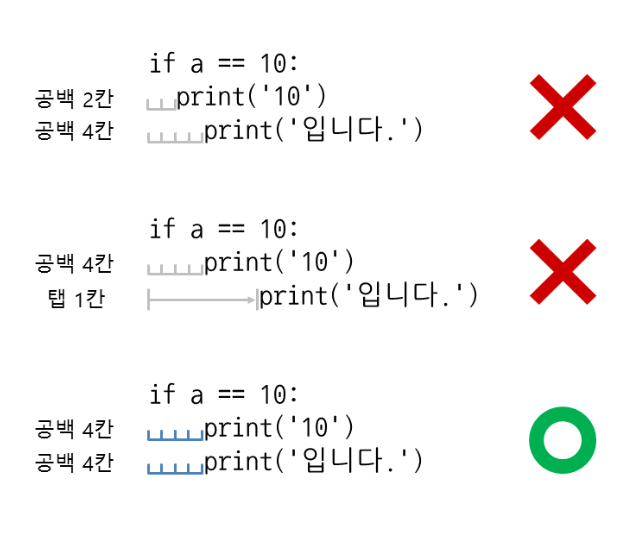

