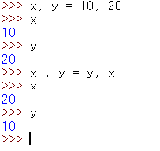

# Day02

## 숫자 계산하기

* 파이썬의 숫자 자료형
  1. 정수 (int)
  2. 실수 (float)
  3. 복소수 (complex)

### 정수계산

* 덧셈뿐만 아니라 뺄셈, 곱셈도 가능하다.

* 나눗셈의 경우 파이썬 2에서는 5/2 는 정수로 표현되지만 파이썬 3에서는 2.5로 실수로 표현된다. 딱 나눠 떨어져도 실수로 표현된다.

#### 소숫점 이하를 버리는 `//` 연산자

* 파이썬 3에서 정수끼리 나눗셈 결과가 정수로 나오도록 만들기 위해서는 `//` 연산자를 이용한다.

* `//` 은 버림 나눗셈(`floor division`) 이라고 부르며 나눗셈의 결과에서 소수점 이하는 버린다. 
* 참고로 실수에 `//` 연산자를 사용하면 결과는 실수가 나오며 소수점 이하는 버린다. 따라서 결과는 항상 `.0` 으로 끝난다.

#### 나눗셈 후 나머지를 구하는 `%` 연산자

* 기본적인 프로그래밍에서 사용되는 `%`와 같은 결과를 나타낸다.

#### 거듭제곱을 구하는 `**` 연산자

* `**`은 거듭제곱 연산자이며 숫자를 특정 횟수만큼 곱한다.

#### 값을 정수로 만들기

* 만약 계산 결과가 실수로 나왔을 때 강제로 정수로 만들수 있다. 형변환을 통해 괄호에 `int` 를 붙이고 숫자 또는 계산식을 넣으면 처리할 수 있다. 
* 특히 int 에 문자열을 넣어도 정수로 만들 수 있다. 단, 정수로 된 문자열일때 가능하다.

#### 객체의 자료형 알아내기

* `type(값)` 함수를 이용하여 해당 객체의 자료형을 알 수 있다.
* 파이썬에서는 숫자도 객체이며, 객체는 클래스로 표현한다.

> 참고
>
> 몫과 나머지를 함께 구할때
>
> `divmod(나눠질수, 나눌수)` 를 통해 확인이 가능함.
>
> 
>
> 진수, 8진수, 16진수
>
> * 정수는 10진수 이외에도 2진수, 8진수, 16진수로도 표현할 수 있다.
> * 2진수 : 숫자 앞에 0b 를 붙이며 0과 1을 사용한다.
> * 8진수 : 숫자앞에 0o(0:숫자 o: 소문자)를 붙이며 0부터 7까지 사용한다.
> * 16진수 : 숫자앞에 0x or 0X 를 붙이며 0부터 9, A부터 F까지 사용한다. (소문자 a부터 f도 가능)

### 실수 계산하기

#### 기본적인 실수 계산

* 덧셈 곱셈, 나눗셈의 경우는 별다른 문제가 없으나 뺄셈의 경우 값이 이상하게 나오게 된다.
* 왜냐하면 컴퓨터는 실수를 표현할 때 오차가 발생하기 때문이다.
* 나중에 실무에ㅔ서 실수를 다룰 때 오차에 대한 적절한 처리가 필요하다.

#### 실수와 정수 계산

* 실수와 정수를 함꼐 계산하면 표현 범위가 넓은 실수로 계산된다. (실수가 정수보다 표현 범위가 넓다.) 

#### 값을 실수로 만들기

* `float(value)` 함수를 통해 value를 실수로 형변환이 가능하다.
* `int()` 와 마찬가지로 value 값으로 숫자, 계산식, 문자열이 가능하다. 

> 복소수
>
> 파이썬에서는 실수부와 허수부로 이루어진 복소수(complex number)도 사용할 수 있다. 이때 허수부는 숫자 뒤에 j를 붙인다. (수학에서는 허수를 i로 표현하지만 공학에서는 j를 사용한다.)
>
> 
>
> 스크립트에서 계산 결과를 출력할 때.
>
> * 스크립트 파일에서 1+1 처럼 계산식만 넣으면 결과가 출력되지 않는다.
>
> 
>
> * `print()` 함수를 이용해야 해당 결과를 확인 할 수 있다.
>
> 

### 괄호 사용

* 수학에서 덧셈 곱셈 순으로 있을 때  곱셈을 덧셈보다 먼저 계산한다. 
* 파이썬에서도 위와 같은 수학 공식이 적용됨.

## 변수

* 변수를 통해 결과를 저장할 수 있다.

* 변수 이름은 원하는 대로 지으면 되지만 다음과 같은 규칙을 지켜야 한다.

  1. 영문 문자와 숫자를 사용할 수 있다.
  2. 대소문자를 구분한다.
  3. 문자부터 시작해야 하며 숫자부터 시작하면 안된다.
  4. _(밑줄 문자) 로 시작할 수 있다.
  5. 특수 문자(+, -, *, /, $, @, &, % 등)는 사용할 수 없다.
  6. 파이썬의 키워드(if, for, while, and, or 등)는 사용할 수 없다.

  

  

### 파이썬 셸에서 변수 선언

  * 숫자변수 문자열 변수 모두 가능하다.

### 변수의 자료형 알아내기

* `type()` 함수를 이용하여 변수를 넣으면 변수(객체)의 자료형이 나온다.

### 변수 여러 개를 한 번에 만들기

* 파이썬에서는 변수 여러 개를 한 번에 만들 수도 있다.

* 만약 변수와 값으 개수가 맞지 않으면 이렇게 에러가 발생한다.

* 변수 여러 개를 만들 때 값이 모두 같아도 된다면 다음과 같은 방식도 사용할 수 있다.

* 두 변수의 값을 바꾸려고 할때, 다음과 같이 변수를 할당할 때 서로 자리를 바꿔주면 된다.

> 참고 
>
> 변수 삭제하기
>
> * 변수 삭제는 `del`를 이용한다.
>
> 
>
> 빈 변수 만들기
>
> * 빈 변수를 만들때는 `None`를 할당해 주면 된다.
>
> 
>
> 

 ## 변수로 계산하기

* 변수 a,b 에 숫자를 할당한 뒤에 a와 b의 값을 더해서 변수 c에 할당했다. 이렇게 변수는 변수끼리 계산할 수 있고, 계산 결과를 다른 변수에 할당할 수 있다.

### 산술 연산 후 할당 연산자 사용하기

* 변수 a 의 값을 10 증가시켜서 출력 하였으나 다시 a를 출력하면 20이 나오게 된다.
* 여기서 `a+10` 은 a 에 10을 더하기만 할 뿐 계산 결과를 유지하지 않는다. 변수 한 개에서 값으 변화를 계속 유지하려면 계산 결과를 다시 변수에 저장해야 한다.

* 위와 같은 번거로움을 없애기 위해 파이썬에서는 변수를 두 번 입력하지 않도록 산술 연산 후 할당 연산자를 제공한다.

*  산술 연산 후 할당 연산자를 사용할 때 주의할 점이 있다. 다음과 같이 만들지 않은 변수에 10을 더한 후 다시 할당하면 에러가 발생한다.

> 참고 
>
> 부호 붙이기
>
> * 계산을 하다 보면 부호를 붙여야 하는 경우도 생긴다. 이때는 값이나 변수 앞에 양수, 음수 부호를 붙이면 된다.
>
> 

## 입력값을 변수에 저장하기.

### input() 함수 사용하기

* `input()` 을 입력한 뒤 엔터 키를 누르면 다음 줄로 넘어간다. 이 상태에서 `Hello, world!` 를 입력한 뒤 엔터키를 누르면 입력한 문자열이 그대로 출력된다.
* 즉 input 함수는 사용자가 입력한 값을 가져오는 함수이다.

### input 함수의 결과를 변수에 할당하기.

* `변수 = input()` 을 통해 변수에 입력한 값을 저장할 수 있다.

* input의 괄호 안에 문자열을 지정해 주면 해당 문자열 문구가 먼저 나오게 된다.

