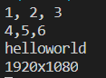

# Day03

## 입력 값을 변수에 저장하기 (2)

### 두 숫자의 합 구하기

```python
a = input('첫 번재 숫자를 입력하세요: ')
b = input('두 번재 숫자를 입력하세요: ')

print(a+b)
```

* 위의 소스를 실행하면 두 수의 합이 아닌 문자열의 연결로 표현이 된다.
* Default 값으로 input 함수를 통해 받아오는 값은 문자열(str) 타입으로 받아온다.


### 입력값을 정수로 변환하기

* 입력 받은 문자를 int로 형변환 시켜 계산하면 원하는 값을 얻어낼 수 있다.

```python
a = int(input('첫 번재 숫자를 입력하세요: '))
b = int(input('두 번재 숫자를 입력하세요: '))


print(type(a))
print(a+b)
```


### 입력 값을 두 변수에 저장하기

* input 한 번에 값을 여러 개 입력받으려면 split 을 사용하여 변수 여러개에 저장해 줄수 있다. (각 변수는 콤마로 구분해준다.)

```python
a,b = input('문자열 두개를 입력하세요 (공백으로 구분)').split()

print('첫번째: '+a+'\n두번째: '+b)
```


### 숫자 여러개 입력받기.

* 위 코드와 같이 여러개를 변수에 저장했을때 여전히 위에처럼 저장되는 type은 문자열(str) 타입이다.

```python
a, b = input('숫자 두 개를 입력하세요: ').split()    # 입력받은 값을 공백을 기준으로 분리
 
print(a + b)
```


* 숫자로 변환해 주기 위해 아래처럼 형 변환을 진행해 준다.

```python
a, b = input('숫자 두 개를 입력하세요: ').split()    # 입력받은 값을 공백을 기준으로 분리
a = int(a)    # 변수를 정수로 변환한 뒤 다시 저장
b = int(b)    # 변수를 정수로 변환한 뒤 다시 저장
 
print(a + b)

```


* 물론 print 안에서 int로 변수를 변환하고 바로 더해도 상관없다.

```python
print(int(a) + int(b))
```

### map 을 사용하여 정수로 변환하기.

* split 의 결과를 매번 int로 변환해주려니 매우 귀찮다. 이를 해결하기 위해 map을 함께 사용하면된다.
* map 에 int 와 input().split() 을 넣으면 split 의 결과를 모두 int로 변환해준다.( 실수로 변환할 떄는 int 대신 float를 넣는다.)

```python
a,b = map(int, input('숫자두개 입력: ').split())
print(a+b)
```


### 입력받은 값을 콤마를 기준으로 분리하기

* split에 기준 문자열을 지정하여 공백이 아닌 다른 문자로 분리해보자.

```python
a,b = map(int, input('숫자두개 입력: ').split(','))
print(a+b)
```


## 출력 방법 알아보기

### 값을 여러 개 출력하기

* print 에는 변수나 값 여러 개를 `,(콤마)` 로 구분하여 넣을 수 있다.

```python
print(1,2,3)
print('hello','world')
```


### sep로 값 사이에 문자 넣기.

* 문자 사이에 공백이 아닌 다른 문자를 넣고 싶을 때 print의 sep에 문자 또는 문자열을 지정해주면 된다.
* sep는 구분자라는 뜻의 separator에서 따왔다.

```python
print(1,2,3,sep = ', ')
print(4,5,6,sep = ',')
print('hello','world',sep = '')
print(1920,1080,sep = 'x')
```



## 줄바꿈 활용하기

* 기본적으로 print에 값을 여러 개 지정하면 한 줄에 모든 값이 출력된다.

```python
print(1,2,3)
```


* print 문에 sep 에 개행 문자 `\n`라는 특별한 문자를 지정하면 값을 한 줄에 하나씩 출력할 수 있다.

```python
print(1,2,3,sep='\n')
```


* `\n`은 값을 다음 줄에 출력하게 만드는 제어문이다. 따라서 sep 에 `\n`을 지정하면 1 2 3 사이에 `\n`이 들어가므로 1을 출력한 뒤 다음 줄에 2를 출력하고 다시 다음줄에 3을 출력한다.
* 단, `\n` 자체는 제어 문자이므로 화면에 출력되지 않는다.
* 참고로 `\n`도 문자이므로 print에 바로 넣어서 사용할 수도 있다.

```python
print('1\n2\n3')
```


### end 사용하기

* print 는 기본적으로 출력하는 값 끝에 `\n`을 붙인다. 그래서 print를 여러 번 사용하면 값이 여러 줄에 출력된다.

```python
print(1)
print(2)
print(3)
```


* print를 여러 번 사용해서 print(1,2,3) 처럼 한줄에 여러 개의 값을 출력하기 위해서는 print의 end에 빈 문자열을 지정해 주면 된다.

```python
print(1,end='')
print(2,end='')
print(3)
```


* end='' 와 같이 end에 빈 문자열을 지정하면 1, 2, 3이 세 줄로 출력되지 않고 한 줄로 붙어서 출력된다. 기본적으로 print의 end에 `\n`이 지정된 상태인데 빈 문자열을 지정하면 강제로 `\n`을 지워주기 때문이다.
* 한 칸을 띄워주고 싶다면 공백 한칸을 지정해 주면 된다.

```python
print(1,end=' ')
print(2,end=' ')
print(3)
```

