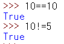

# day04

## 불과 비교 연산자 사용하기

* 불 연산자 : `True`, `False`


### 비교 연산자의 판단 결과

* 파이썬에서는 비교 연산자와 논리 연산자의 판단 결과로 `True,False`를 사용합니다. 즉, 비교 결과가 맞으면 `True`, 아니면 `False`입니다.

```python
3 > 1
True
```

* 부등호 `>` 로 두 숫자를 비교했습니다. 3이 1보다 크니 결과는 참으로 `True`가 나온다.


### 숫자가 같은지 다른지 비교하기

* 두 숫자가 같은지 또는 다른지 비교하기
  * 두 숫자가 같을때 : `==(Equal)`
  * 다른지 비교할 때 : `!=(not equal)`



### 문자열이 같은지 다른지 비교하기

* 숫자뿐만 아니라 문자열도 `==`와 `!=` 로 비교가 가능하다.
* 문자열을 비교할 때 대소문자를 구분한다.


### 부등호 사용하기

* 부등호는 수학 시간에 배운 내용과 같다. 큰지, 작은지, 크거나 같은지, 작거나 같은지를 판단한다.


### 객체가 같은지 다른지 비교하기.

* `is` 와 `is not` 을 이용하여 객체를 비교할 수 있다.


* 1 과 1.0은 정수와 실수라는 차이점이 있지만 값은 같다. 따라서 `==`로 비교하면 `True`가 나오지만 `is`로 비교해보면 `False`가 나온다. 왜냐하면 1은 정수 객체, 1.0은 실수 객체이므로 두 객체는 서로 다르기 때문이다.
* 물론 1과 1.0을 `is not`으로 비교하면 `True`가 나오게 된다.

> 참고 | 정수 객체와 실수 객체가 서로 다른것을 확인하기.
>
> 정수 객체와 실수 객체가 서로 다른지 확인하려면 id 함수를 사용하면 된다. id는 객체의 고유한 값(메모리 주소)을 구한다. (이 값은 파이썬을 실행하는 동안에는 계속 유지되며 다시 실행하면 달라진다.)
>
> 

> 참고 | 값 비교에 is를 쓰지 않기.
>
> 값을 비교할 때는 is를 사용하면 안된다. 다음과 같이 변수 a 에 -5를 할당한 뒤 a is -5 를 실행하면 True가 나오지만 다시 -6을 할당한 뒤 a is -6을 실행하면 False가 나온다.
>
> 

## 논리 연산자 사용하기

* 논리 연산자는 `and, or, not`이 있다.

### and

* `and`는 두값이 모두 `True`라야 `True`입니다. 하나라도 `False`이면 `False`가 나온다.


### or

* `or`는 두 값 중 하나라도 `True`이면 `True`이다. 두 값이 모두 `False`라야 `False`가 된다.


### not

* `not`은 논릿값을 뒤집는다. `not True`는 `False`가 되고, `not False`는 `True`가 된다.


* 논리 연산자가 식 하네에 들어있으면 `not, and, or`순으로 판단한다.


## 논리 연산자와 비교 연산자를 함께 사용하기.


* 비교 연산자와 논리 연산자가 함께 있을 때 비교 연산자 (`is,is not, ==, !=, <, >, <=, >=`)를 먼저 판단하고 논리 연산자 (`not, and, or`)를 판단하게 된다.
* 이처럼 파이썬은 영어 문장과 흡사한 구조를 가지고 있어서 코드가 읽기 쉬운 것이 장점이다.

> 참고 | 정수, 실수, 문자열을 불로 만들기
>
> 정수, 실수, 문자열을 불로 만들 때는 bool을 사용하면 된다. 이때 정수 1은 True, 0은 False이다.
>
> 만약 문자열의 내용이 'False'라도 불로 만들면 True가 된다.
>
> 문자열의 내용 자체는 판단하지 않으며 값이 있으면 True 이다.
>
> 
>
> 

> 참고 | 단락 평가
>
> 논리 연산에서 중요한 부분이 단락 평가(short-circuit evalution)이다. 단락 평가는 첫 번째 값만으로 결과가 확실할 때 두 번째 값은 확인(평가)하지 않는 방법을 말한다.
>
> 즉, and 연산자는 두값이 모두 참이라야 참이므로 첫 번째 값이 거짓이면 두 번째 값은 확인 하지 않고 바로 거짓으로 결정한다.
>
> ```python
> print(False and True)
> print(False and False)
> ```
>
> 
>
> or 연산자는 두 값 중 하나만 참이라도 참이므로 첫 번째 값이 참이면 두 번째 값은 확인하지 않고 바로 참으로 결정한다.
>
> ```python
> print(True or True)
> print(True or False)
> ```
>
> 
>
> 특히 파이썬에서 논리 연산자는 이 단락 평가에 따라 반환하는 값이 결정된다. True, False를 논리 연산자로 확인하면 True, False가 나왔는데 True and 'Python'의 결과는 무엇이 나올까?
>
> 
>
> 문자열 'Python'도 불로 따지면 True라서 True and True가 되어 True가 나올 것 같지만 'Python' 이 나온다. 왜냐하면 파이썬에서 논리 연산자는 마지막으로 단락 평가를 실시한 값을 그대로 반환하기 때문이다. 따라서 논리 연산자는 무조건 불을 반환하지 않는다.
>
> 다음과 같이 마지막으로 단락 평가를 실시한 값이 불이면 불을 반환하게 된다.
>
> 
>
> 여기서 문자열 'Python'을 'True'로 쳐서 and 연산자가 두 번째 값까지 확인하므로 두 번째 값이 반환된다. 만약 다음과 같이 and 연산자 앞에 False 나 False로 치는 값이 와서 첫 번째 값 만으로 결과가 결정나는 경우에는 첫 번째 값이 반환된다.
>
> or 연산자도 마찬가지로 마지막으로 단락 평가를 실시한 값이 반환된다. 다음은 or 연산자에서 첫 번째 값만으로 결과가 결정되므로 첫 번째 값이 반환된다.
>
> 
>
> 만약 두 번째 값까지 판단해야 한다면 두 번째 값이 반환된다.
>
> 

## 문자열 사용하기.

* 문자열에는 생각보다 다양한 기능이 숨어 있다.
* 파이썬에서 문자열은 `''(작은따옴표)` 로 묶어서 문자열을 만든다.


- 특히 파이썬에서는 작은따옴표로 묶는 방법 이외에도 문자열을 만드는 여러 가지 방법이있다.

  1. `""(큰따옴표)`

  

  2. `'''(작은 따옴표 3개)`

  

  3. `"""(큰따옴표 3개)`

  

### 여러 줄로 된 문자열 사용하기

* 여러 줄로 된 문자열(multiline string)은 다음과 같이 `'''(작은 따옴표 3개)`로 시작하고 엔터키를 누르면 다음 주로 이동한다.
* 문자열을 계속 입력하고 마지막 줄에 `'''`로 닫은 뒤 엔터 키를 누르면 프롬프트로 돌아온다.


### 문자열 안에 작은 따옴표나 큰 따옴표 포함하기.

* 문자열을 사용하다 보면 문자열 안에 작은따옴표나 큰따옴표를 넣어야 할 경우가 생긴다.
* 먼저 문자열 안에 작은따옴표를 넣고 싶다면 문자열을 큰따옴표로 묶어준다.


* 반대로 문자열 안에 큰따옴표를 넣고 싶다면 문자열을 작은따옴표로 묶어준다.


* 하지만 작은따옴표 안에 작은따옴표를 넣거나 큰따옴표 안에 큰따옴표를 넣을 수는 없다.


### 스크립트로 작성

```python
single_quote = '''"안녕하세요."
'파이썬'입니다.'''

double_quote1 = """"Hello"
'Python'"""

double_quote2 = """Hello, 'Python'"""

print(single_quote)
print(double_quote1)
print(double_quote2)
```


> 참고 | 문자열에 따옴표를 포함하는 다른 방법
>
> 작은 따옴표 안에 작은따옴표를 넣을 때 작은따옴표 안에 \\(역슬래시)를 붙이면 된다.
>
> 

> 참고 | 따옴표 세 개로 묶지 않고 여러 줄로 된 문자열 사용하기
>
> 문자열 안에 개행 문자 (\\n)을 넣으면 따옴표 세 개로 묶지 않아도 여러 줄로 된 문자열을 사용할 수 있다.
>
> 
>
> 사실 따옴표 세 개로 묶어서 여러 줄로 된 문자열을 만들면 줄바꿈이 되는 부분에 \\n 이 들어있다. print 없이 출력해보면 \\n이 그대로 나온다.
>
> 

> 참고 | 한글 문자열 출력이 안 될때
>
> 파이썬 스크립트 파일에 한글 문자열을 넣었을 때 에러가 나는 경우가 있다.
>
> 이때는 .py 파일을 UTF-8이 아닌 CP949 로 저장했기 때문이다.

> 참고 | 파이썬 셸과 스크립트 파일의 결과가 다르다.
>
> 파이썬 셸의 >>> 에서 문자열을 그대로 출력하면 작은따옴표도 함께 출력된다.
>
> 
>
> 파이썬 셸에서는 문자열이나 변수를 그대로 입력하면 출력 결과가 문자열이라는 것을 정확하게 표현하기 위해 작은따옴표로 묶인 문자열이 출력된다.
>
> 스크립트 파일에서는 문자열이나 변수만으로 출력을 할 수 없으므로 print 를 사용한다.
>
> ```python
> print('Hello, world!')
> ```
>
> 
>
> 
>
> 이렇게 스크립트 파일에서 print로 문자열을 출력해보면 작은따옴표 없이 문자열만 출력된다. 스크립트 파일뿐만 아니라 파이썬 셸에서도 print 를 사용하면 작은따옴표 없이 출력된다.
>
> 

