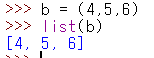

# Day05

## 10.1 리스트 만들기

* 변수에 값을 저장할 때 `[ ](대괄호)`로 묶어주면 리스트가 되며 각 값은 `,(콤마)`로 구분해준다.


### 10.1.1 리스트에 여러 가지 자료형 저장하기.

*  리스트는 문자열, 정수, 실수, 불 등 모든 자료형을 저장할 수 있으며 자료형을 섞어서 저장해도 된다.


### 10.1.2 빈 리스트 만들기

* 빈 리스트를 만들 때는 `[]`만 지정하거나 `list`를 사용하면 된다.


* 보통 빈 리스트를 만들어 놓은 뒤에 새 값을 추가하는 방식으로 사용한다.

### 10.1.3 range를 사용하여 리스트 만들기

* `range`는 연속된 숫자를 생성하는데 `range`에 10을 지정하면 0부터 9까지 숫자를 생성한다.


* 위와 같이 나와서 10까지 생성될 것 같지만 10은 포함되지 않는다.


* `range`에 시작하는 숫자와 끝나는 숫자를 지정할 수도 있다.


* 증가폭 또한 사용할 수 있다.


* 만약 증가폭을 음수로 지정하면 해당 값만큼 숫자가 감소한다.


## 10.2 튜플 사용하기

* 튜플은 리스트처럼 요소를 일렬로 저장하지만, 안에 저장된 요소를 변경, 추가, 삭제를 할 수 없다.
* 간단하게 읽기 전용 리스트라고 할 수 있다.
* 변수에 값을 저장할 때 `( )(괄호)`로 묶어주면 튜플이 되며 각 값은 `,(콤마)`로 구분해준다. 또는 괄호로 묶지 않고 값만 콤마로 구분해도 튜플이 된다.


* 튜플도 리스트처럼 여러 자료형을 섞어서 저장해도 된다.


* 보통 튜플은 요소가 절대 변경되지 않고 유지되어야 할 때 사용한다.
* 요소가 자주 변경될때는 튜플이 아닌 리스트를 사용해 준다.


### 10.2.1 요소가 한개 들어있는 튜플 만들기

* 다음과 같이 값 한 개를 괄호로 묶으면 튜플이 아니라 그냥 값이 된다.


* 요소가 한개인 튜플은 다음과 같이 만든다.


### 10.2.2 range를 사용하여 튜플 만들기

* `tuple()`함수를 이용하여 튜플 생성이 가능하다.
* list와 같은 방식으로 사용이 가능하다.


### 10.2.3 튜플을 리스트로 만들고 리스트를 튜플로 만들기.

* tuple() 안에 리스트를 넣으면 새 튜플이 생긴다.


* 반대로 list 안에 튜플을 넣으면 새 리스트가 생긴다.



> 참고 | list와 tuple 에 문자열을 넣으면?
>
> list와 tuple 에 문자열을 넣으면 문자 리스트, 문자 튜플이 생성된다.
>
> 

> 참고 | 리스트와 튜플로 변수 만들기
>
> 리스트와 튜플을 사용하면 변수 여러 개를 한 번에 만들 수 있다.
>
> 이떄 변수의 개수와 리스트(튜플)의 요소 개수는 같아야 한다.
>
> 
>
> 리스트와 튜플 변수로도 변수 여러 개를 만들 수 있다.
>
> 다음과 같이 리스트와 튜플의 요소를 변수 여러 개에 할당하는 것을 리스트 언패킹, 튜플 언패킹 이라고 한다.
>
> 
>
> 여기서 전에 배웠던 input().split() 은 리스트를 반환한다.
>
> 
>
> 그리고 리스트 패킹과 튜플 패킹은 변수에 리스트 또는 튜플을 할당하는 과정을 뜻한다.
>
> ```python
> a = [1,2,3] # 리스트 패킹
> b = (1,2,3) # 튜플 패킹
> c = 1,2,3   # 튜플 패킹
> ```
>
> 