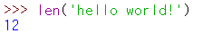
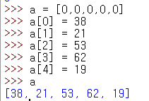
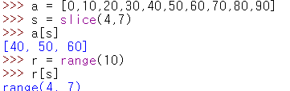

# day06

## 11. 시퀀스 자료형 활용하기.

* 파이썬에서는 리스트, 튜플, range, 문자열처럼 값이 연속적으로 이어진 자료형을 시퀀스 자료형(sequence types)라고 부른다.

### 11.1 시퀀스 자료형의 공통 기능 사용하기.

* 시퀀스 자료형의 가장 큰 특징은 공통된 동작과 기능을 제공한다는 점이다.
* 따라서 시퀀스 자료형의 기본적인 사용 방법을 익혀 두면 나중에 어떠한 시퀀스 자료형을 접하게 되더라도 큰 어려움 없이 바로 사용할 수 있다.
* 시퀀스 자료형으로 만든 객체를 시퀀스 객체라고 하며, 시퀀스 객체에 들어있는 각 값을 요소(element)라고 부른다.

### 11.1.1 특정 값이 있는지 확인하기.

* `값 in 시퀀스객체` 를 통해 해당 시퀀스 객체에 값이 있는지 확인 가능하다.

* 반대로 in 앞에 not을 붙이면 특정 값이 없는지 확인한다.

* `in`과 `not in`은 튜플, range, 문자열도 같은 방법으로 활용할 수 있다.

### 11.1.2 시퀀스 객체 연결하기

* 시퀀스 객체는 `+` 연산자를 사용하여 객체를 서로 연결하여 새 객체를 만들 수 있다.

* 단, 시퀀스 자료형 중에서 range는 `+` 연산자로 객체를 연결할 수 없다.

* 이때는 ragne를 리스트 또는 튜플로 만들어서 연결하면 된다.

* 문자열은 `+` 연산자로 여러 문자열을 연결할 수 있다.

> 참고 | 문자열에 숫자 연결하기.
>
> 문자열에 숫자를 연결하면 에러가 발생한다.
>
> 
>
> 문자열에 숫자를 연결하고 싶다면 해당 숫자를 문자열로 바꾼후 연산해 주어야 한다.
>
> 

### 11.1.3 시퀀스 객체 반복하기.

* `*` 연산자는 시퀀스 객체를 특정 횟수만큼 반복하여 새 시퀀스 객체를 만든다.
* 0 또는 음수를 곱하면 빈 객체가 나오며 실수는 곱할 수 없다.

* 마찬가지로 ragne는 `*` 연산자를 사용할 수 없다.

* 문자열도 `*` 연산을 통해 반복할 수 있다.

## 11.2 리스트와 튜플의 요소 개수 구하기.

* `len()` 함수를 이용해 리스트나 튜플의 요소 개수를 구할 수 있다.

### 11.2.2 range의 숫자 생성 개수 구하기

* range 에 len 함수를 사용하면 숫자가 생성되는 개수를 구한다.

### 11.2.3 문자열의 길이 구하기.

* 문자열 또한 len 함수를 이용하여 개수를 구할 수 있다.

> 참고 | UTF-8 문자열의 바이트 수 구하기.
>
> 다음과 같은 방법으로 UTF-8 인코딩으로 저장된 문자열이 차지하는 실제 바이트 수를 구할 수 있다.
>
> 

## 11.3 인덱스 사용하기

* 시퀀스 객체의 각 요소는 순서가 정해져 있으며, 이 순서를 인덱스라고 부른다.
* 다음과 같이 시퀀스 객체에 ``를 붙이고 `[]`안에 각 요소의 인덱스를 지정하면 해당 요소에 접근할 수 있다.

* 인덱스의 시작은 **`0`** 이다.
* range, 튜플, 문자열도 [] 에 인덱스를 지정하면 해당 요소를 가져올 수 있다.

> 참고 | 시퀀스 객체에 인덱스를 지정하지 않으면?
>
> * 시퀀스 객체에 인덱스를 지정하지 않은 상태는 해당 객체 전체를 뜻한다. 따라서 다음과 같이 리스트 a를 출력하면 `[]`를 포함하여 리스트 전체가 출력된다.
>
> 

> 참고 | \_\_getitem\_\_ 매서드
>
> * 시퀀스 객체에서 `[]`를 사용하면 실제로는 \_\_getitem\_\_  매서드를 호출하여 요소 값을 가져온다.
>
> 

### 11.3.1 음수 인덱스 지정하기.

* 인덱스를 음수로 지정하면 뒤에서부터 요소에 접근하게 된다.

### 11.3.2 인덱스의 범위를 벗어나면?

* `IndexError`가 발생한다!

### 11.3.3 마지막 요소에 접근하기

* 시퀀스 객체에 인덱스를 -1 로 지정하면 뒤에서 첫 번째 요소에 접근한다. (시퀀스 객체의 마지막 요소)
* 다른 방법으로도 구할 수 있다.

### 11.3.4 요소에 값 할당하기

* `시퀀스객체[인덱스] = 값` 을 통해 요소에 값을 할당할 수 있다.

* 튜플은 사용할 수 없다.

* range와 문자열도 안에 저장된 요소를 변경할 수 없다.
* 즉 시퀀스 자료형 중에서 튜플, range, 문자열은 읽기 전용이다.

### 11.3.5 del로 요소 삭제하기.

* `del 시퀀스객체[인덱스]` 를 통해 해당 시퀀스 요소를 삭제할 수 있다. (이것 또한 list만 가능!)

## 11.4 슬라이스 사용하기

* `시퀀스객체[시작인덱스:끝인덱스]` 를 통해 시퀀스 객체의 일부를 잘라낼 수 있다. 
* 슬라이스의 결과로 새로운 리스트를 생성한다.

* `[]` 안에 시작 인덱스와 끝 인덱스를 지정하면 해당 범위의 리스트를 잘라서 가져올 수 있다. 
* 여기서 주의할 점은 끝 인덱스는 가져오려는 범위에 포함되지 않는다. 
* 따라서 끝 인덱스는 실제로 가져오려는 인덱스보다 1을 더 크게 지정해야 한다.

* `a[1:1]` 처럼 시작 인덱스와 끝 인덱스를 같은 숫자로 지정하면 아무것도 가져오지 않는다.

### 11.4.1 리스트의 중간 부분 가져오기.

* 특히 슬라이스는 `a[4:-1]`과 같이 음수를 인덱스로 지정할 수 도 있다.

### 11.4.2 인덱스 증가폭 사용하기.

* 슬라이스는 인덱스의 증가폭을 지정하여 범위 내에서 인덱스를 건너뛰며 요소를 가져올 수 있다.

* a[2:8:3]을 실행하니 [20, 50]이 나왔다.
* 왜 이런 결과가 나왔을까?
  * 먼저 시작 인덱스가 2이므로 20부터 가져온다. 
  * 그리고 인덱스 증가폭을 3으로 지정했으므로 인덱스 5의 50, 인덱스 8의 80을 가져올 수 있다. 
  * 하지만, 끝 인덱스를 8로 지정했으므로 인덱스 7까지만 가져온다. 
  * 따라서 20과 50만 가져와서 [20, 50]이 나온다.

### 11.4.3 인덱스 생략하기

* 슬라이스를 사용할 때 시작 인덱스와 끝 인덱스를 생략할 수도 있다.
* 인덱스를 생략하는 방법은 시퀀스 객체의 길이를 몰라도 되기 때문에 자주 쓰이는 방식이다.

* 둘다 생략하면 전체를 가져온다.

### 11.4.4 인덱스를 생략하면서 증가폭 사용하기

* 시작인덱스 또는 끝 인덱스를 생략하면서 인덱스 증가폭을 지정할 수 있다.

* 모두 생략하고 증가폭만 지정하면 인덱스 0 부터 증가폭 만큼 증가하면서 요소를 가져온다.

* 모두 생략하면 리스트 전체를 가져온다.

### 11.4.5 len 응용하기

* len을 응용하여 리스트 전체를 가져올 수 있다.

### 11.4.6 튜플, range, 문자열에 슬라이스 사용하기.

* 튜플, range, 문자열도 시퀀스 객체이므로 모두 슬라이스 사용이 가능하다.
* 사용 방법은 리스트와 같다.

* 튜플

* range
  * range 는 튜플과 달리 요소가 모두 표시되지 않고 생성 범위만 표시된다. 요소를 표현하려면 list에 넣으면 된다.

* 문자열

> **참고 |** **slice 객체 사용하기**
>
> 파이썬에서는 slice 객체를 사용하여 시퀀스 객체(시퀀스 자료형으로 만든 변수)를 잘라낼 수도 있다.
>
> **슬라이스객체 = slice(끝인덱스)**
>
> **슬라이스객체 = slice(시작인덱스, 끝인덱스)**
>
> **슬라이스객체 = slice(시작인덱스, 끝인덱스, 인덱스증가폭)**
>
> **시퀀스객체[슬라이스객체]**
>
> **시퀀스객체.\_\_getitem\_\_(슬라이스객체)**
>
> 다음과 같이 시퀀스 객체의 `` 또는 \_\_getitem\_\_ 메서드에 slice 객체를 넣어주면 지정된 범위만큼 잘라내서 새 객체를 만든다.
>
> 
>
> 슬라이스 자체를 객체로 만들어 사용도 가능하다.
>
> 
>
> 

### 11.4.7 슬라이스에 요소 할당하기

* 시퀀스 객체는 슬라이스로 범위를 지정하여 여러 요소에 값을 할당할 수 있다.

* 위에는 정확히 범위와 할당할 리스트의 요소 개수를 정확히 맞추었지만, 사실 개수를 맞추지 않아도 상관없다.
* 만약 할당할 요소 개수가 적으면 그만큼 리스트이 요소 개수도 줄어든다.

* 요소의 개수가 많으면 그만큼 리스트의 요소 개수가 증가한다.

* 슬라이스의 증가폭을 이용하여 할당 할 수도 있다.

* 단, 인덱스 증가폭을 지정했을 때는 슬라이스 범위의 요소 개수와 할당할 요소 개수가 정확히 일치해야 한다.

* 튜플, range, 문자열은 슬라이스 범위를 지정하더라도 요소를 할당할 수 없다.

### 11.4.8 del 로 슬라이스 삭제하기

* 슬라이스 삭제는 다음과 같이 del 뒤에 삭제할 범위를 지정해주면 된다.

* 인덱스 증가폭을 지정하면 인덱스를 건더뛰면서 삭제한다.

* 튜플, range, 문자열은 del 사용이 불가능하다.