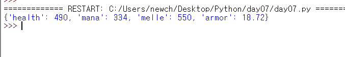

# Day07

## 12. 딕셔너리 사용하기

* 연간된 값을 묶어서 저장하는 용도로 딕셔너리라는 자료형을 제공한다.

```python
lux = {'health':490, 'mana':334, 'melle':550,'armor':18.72}
print(lux)
```



### 12.1.1 키 이름 중복시

* 딕셔너리를 만들 때 키이름이 중복된다면 가장 뒤에 있는 값만 사용한다.
* 또한 중복된 키는 저장되지 않는다.


### 12.1.2 딕셔너리 키의 자료형

* 딕셔너리의 키는 문자열뿐만 아니라 정수, 실수, 불도 사용할 수 있으며 자료형을 섞어서 사용해도 된다.
* 값에는 리스트, 딕셔너리 등을 포함하여 모든 자료형을 사용 할 수 있다.


* 단 키에는 리스트와 딕셔너리를 사용할 수 없다.


### 12.1.3 빈 딕셔너리 만들기

* 빈 딕셔너리를 만들 때는 `{}`만 지정하거나 dict를 사용하면 된다. 보통은 `{}`를 주로 사용한다.


### 12.1.4 dict로 딕셔너리 만들기

* `딕셔너리 = dict( 키1=값1, 키2=값2 )`
* `딕셔너리 = dict( zip[ 키1, 키2 ], [ 값1, 값2 ] )`
* `딕셔너리 = dict( [ ( 키1, 값1 ), ( 키2, 값2) ] )`
* `딕셔너리 = dict( { 키1: 값1, 키2: 값2 } )`


1. dict 에서 `키=값` 형식

   * 이때는 키에 `''(작은따옴표)` 나  `""(큰따옴표)` 를 사용하지 않아야 한다.
   * 키는 딕셔너리를 만들고 나면 문자열로 바뀐다.

   

2. dict 에서 zip 함수를 이용하는 방법

   * 키가 들어있는 리스트와 값이 들어있는 리스트를 차례대로 zip에 넣은 뒤 다시 dict에 넣는다.

   

3. 리스트 안에 `(키, 값)` 형식의 튜플을 나열하는 방법

   

4. dict 안에서 중괄호로 딕셔너리를 생성하는 방법

   

