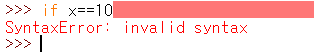

# Day07

## 12. 딕셔너리 사용하기

* 연간된 값을 묶어서 저장하는 용도로 딕셔너리라는 자료형을 제공한다.

```python
lux = {'health':490, 'mana':334, 'melle':550,'armor':18.72}
print(lux)
```


### 12.1.1 키 이름 중복시

* 딕셔너리를 만들 때 키이름이 중복된다면 가장 뒤에 있는 값만 사용한다.
* 또한 중복된 키는 저장되지 않는다.


### 12.1.2 딕셔너리 키의 자료형

* 딕셔너리의 키는 문자열뿐만 아니라 정수, 실수, 불도 사용할 수 있으며 자료형을 섞어서 사용해도 된다.
* 값에는 리스트, 딕셔너리 등을 포함하여 모든 자료형을 사용 할 수 있다.


* 단 키에는 리스트와 딕셔너리를 사용할 수 없다.


### 12.1.3 빈 딕셔너리 만들기

* 빈 딕셔너리를 만들 때는 `{}`만 지정하거나 dict를 사용하면 된다. 보통은 `{}`를 주로 사용한다.


### 12.1.4 dict로 딕셔너리 만들기

* `딕셔너리 = dict( 키1=값1, 키2=값2 )`
* `딕셔너리 = dict( zip[ 키1, 키2 ], [ 값1, 값2 ] )`
* `딕셔너리 = dict( [ ( 키1, 값1 ), ( 키2, 값2) ] )`
* `딕셔너리 = dict( { 키1: 값1, 키2: 값2 } )`


1. dict 에서 `키=값` 형식

   * 이때는 키에 `''(작은따옴표)` 나  `""(큰따옴표)` 를 사용하지 않아야 한다.
   * 키는 딕셔너리를 만들고 나면 문자열로 바뀐다.

   

2. dict 에서 zip 함수를 이용하는 방법

   * 키가 들어있는 리스트와 값이 들어있는 리스트를 차례대로 zip에 넣은 뒤 다시 dict에 넣는다.

   

3. 리스트 안에 `(키, 값)` 형식의 튜플을 나열하는 방법

   

4. dict 안에서 중괄호로 딕셔너리를 생성하는 방법

   

## 12.2 딕셔너리 키에 접근하고 값 할당하기

* 딕셔너리의 키에 접근할 때는 딕셔너리 뒤에 `[](대괄호)` 를 사용하여 `[]`안에 키를 지정해 주면 된다.

  

> 참고 | 딕셔너리에 키를 지정하지 않으면?
>
> 딕셔너리에 키를 지정하지 않은 상태는 해당 딕셔너리 전체를 뜻한다.

### 12.2.1 딕셔너리의 키에 값 할당하기

* 딕셔너리는 `[]`로 키에 접근한 뒤 값을 할당한다.
* ` 딕셔너리[키] = 값`


* 딕셔너리에 없는 키를 가져오면 에러가 발생한다.

  

### 12.2.2 딕셔너리에 키가 있는지 확인하기

* `키 in 딕셔너리` 를 통해 키가 있는지 확인 할 수 있다.


* `not in` 을 붙이면 키가 없는지 확인한다.


> 참고| 해시
>
> * 딕셔너리는 해시(Hash) 기법을 이용해서 데이터를 저장한다.
> * 보통 딕셔너리와 같은 키-값 형태의 자료형을 해시, 해시 맵, 해시테이블 등으로 부르기도 한다.

### 12.2.3 딕셔너리의 키 개수 구하기

* 딕셔너리의 키와 값을 직접 타이핑할 때는 갯수를 알수 있으나 실무에서는 함수등을 사용해서 딕셔너리를 생성하거나 키를 추가하기 때문에 키의 개수가 눈에 보이지 않는다.
* 이때 `len`함수를 이용하여 딕셔너리의 길이를 구할 수 있다.


## 13. if 조건문으로 특정 조건일 때 코드 실행하기

* 조건문을 사용하면 조건에 따라 다른 코드를 실행할 수 있다. 

```python
if 비가 온다면:
    우산을 가지고 나간다.
    
if 날씨가 춥다면:
    코트를 입고 나간다.

if 날씨가 덥다면:
    빈소매에 얆은 옷을 입고 나간다.    
```

> 참고 | 의사코드
>
> * 프로그래밍이나 컴퓨터 이론을 공부하다 보면 의사코드(pseudo code) 라는 말을 접하게 된다.
> * 의사 코드는 실제 프로그래밍 언어가 아닌 사람의 언어로 프로그램이 언어를 표현한 것이다.
> * 보통 특정 프로그래밍 언어를 사용하지 않고 알고리즘이나 컴ㅁ퓨터 명령을 기술할 때 사용한다.
>
> ```python
> x = 10 # 파이썬 코드
> 변수 x에 10 할당 # 한글로 표현한 의사코드
> ```
>
> 

### 13.1 if 조건문 사용하기

* if 조건문은 if 에 조건식을 지정하고 `:(콜론)` 을 붙이며 다음 줄에 실행코드가 온다.
* 이때 실행할 코드는 반드시 들여쓰기를 해야한다.

```python
if 조건식:
    코드
```


* IDLE의 파이썬 셸에서는 자동으로 들여쓰기가 되지만, 콘솔에서 실행한 파이썬 셸에서는 자동으로 들여쓰기가 되지 않는다.

### 13.1.1 if 조건문의 기본 형태와 실행 흐름 알아보기

* if 조건문의 기본 형태


* if 조건문의 실행 흐름


### if 조건문을 사용할 떄 주의할 점

1. 값을 비교할 때는 `=` 가 아닌 `==`으로비교하기

   

2. 조건식 끝에 `:` 빠뜨리지 않기

   

### 13.1.3 if 조건문에서 코드를 생략하기

* if 조건식 다음에 실행할 코드에서 `pass` 를 입력하게 되면 해당 조건문이 참일 시 아무것도 하지 않게 된다.
* 여기서 `pass` 는 아무 일도 하지 않는 코드라 의미가 없을 것 같지만 나중에 작성해야 할 코드를 표시할 때 사용할 수 있다.


> 참고 | TODO
>
> * TODO 는 해야 할 일이라는 뜻인데 보통 주석에 넣는다.
> * 이렇게 TODO를 넣어 두면 검색으로 쉽게 찾을 수 있다.
> * TODO 이외에도 FIXME, BUG, NOTE 등과 같이 코드는 아니지만 일관된 주석을 사용한다.

### 13.2 if 조건문과 들여쓰기

* if 다음에 오는 코드들은 반드시 들여쓰기 깊이가 같아야 한다.

출처 : [코딩도장](https://dojang.io/mod/page/view.php?id=2220)

